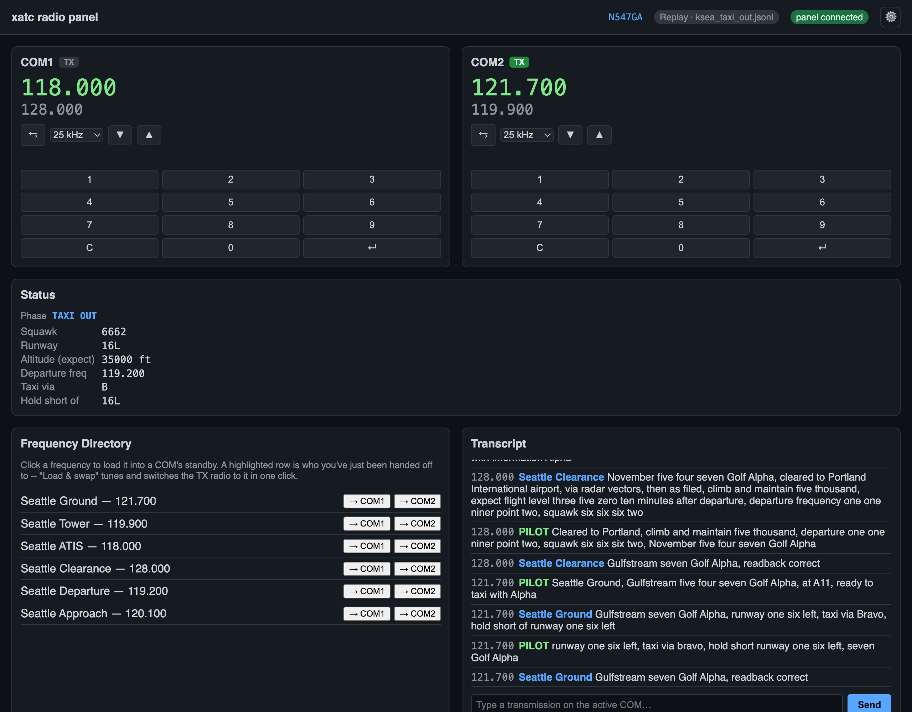

# Radio panel

**Available now.**



*The radio panel after a clearance and taxi exchange at KSEA: COM2 is transmitting on Seattle Ground, the Status section shows what's been issued (squawk, runway 16L, taxi via B, hold short of 16L), and the transcript shows each pilot call and ATC reply, including the readback checks.*

## What it does

A local web app (FastAPI + one WebSocket) serves a single, dependency-free HTML/JS
page that behaves like a real COM radio stack, open in a browser on any device on your
network:

- **COM1 and COM2** -- active and standby frequencies, a flip-flop button, a tuning
  knob (drag, scroll, or a numeric keypad, 25 kHz or 8.33 kHz steps), and a TX light
  that's green when that radio is selected to transmit and red once a push-to-talk mic
  stream is actually confirmed open (not just "the button is pressed").
- **Two-way sync with X-Plane.** Tuning the panel writes the COM frequency to the sim;
  turning the knobs in the cockpit updates the panel. Either one can drive.
- **Status section** -- the current flight phase and whatever's actually been issued on
  the current clearance: squawk, runway, assigned or expected altitude, departure
  frequency, taxi route, and hold-shorts. Only fields that are actually set show up, so
  it starts almost empty on the ramp and fills in as ATC issues things.
- **Frequency directory** -- nearby controller positions, sorted by relevance to the
  current phase. Click one to load it into a COM's standby. Whichever position you've
  just been [handed off to](controller-positions.md#handoffs) is highlighted, with a
  one-click "Load & swap" that tunes and switches the TX radio to it directly, instead
  of loading to standby and flip-flopping separately.
- **Transcript** -- every transmission, tagged by frequency and station, plus a
  type-to-transmit box for text mode.
- **Push-to-talk** -- an on-screen button, or holding Space while the page has focus
  (ignored while typing in a text field). See [Voice](voice.md).
- **Settings** -- a gear icon opens a full Settings page covering everything xatc needs
  to fly: flight plan, connection, voice, ATC behavior, and advanced overrides. See
  [Settings](#settings) below.
- **Sim connection indicator** -- shows live X-Plane version and connection state, or
  which replay file is playing and whether it's still moving or holding at the end of
  the recording.

## Text mode

Everything works with no voice and no AWS account: type a transmission into the box
instead of speaking it, and the panel's the primary UI. This is also how the project
develops and tests without needing a live sim.

## Two-way COM sync

All frequency changes go through one interface the engine's sim bridge implements,
whether that's a live X-Plane Web API connection or a recorded/replayed flight -- the
panel never talks to a specific bridge implementation directly, so it behaves
identically either way.

## Settings

Everything xatc needs to fly is configured from one place: click the gear icon to open
the **Settings** page (ADR 0007 in the repository), which replaced an earlier one-tab
options modal. It's organized into five tabs, each with its own **Save** button so
changing one doesn't touch the others:

| Tab | Covers |
|---|---|
| **Flight** | Flight plan source, callsign, aircraft type, departure/destination, route, cruise altitude |
| **Connection** | X-Plane host/port, and an X-Plane installation folder override |
| **Voice** | Push-to-talk on/off, AWS profile/region, Transcribe vocabulary, [radio effect](radio-fx.md) preset, joystick PTT |
| **ATC** | [Intent parsing mode](intent-parsing.md), altitude source, conformance strictness, and the 14 CFR 91.117(d) heavy-speed exception |
| **Advanced** | `apt.dat`/`atc.dat` overrides, the debrief folder, and the panel's own host/port |

**Flight plan: manual or SimBrief.** The Flight tab's Manual/SimBrief toggle switches
between typing everything in by hand and pulling a real OFP: enter a SimBrief username
and click **Preview** to fetch the latest plan without saving anything yet, review
callsign/type/route/cruise in the preview, then click **Use this plan** to copy it into
the form and save it in one step. Once the flight leaves the ramp (any phase past
`PARKED`), the whole Flight tab locks with the banner *"Flight plan locked after
clearance -- changes here won't take effect this flight."*

**Learn PTT button.** On the Voice tab, click **Learn PTT button**, then press a button
on your yoke or joystick -- xatc listens for 10 seconds and fills in the
`<device>:<button>` spec for you (Windows only; see [Joystick/yoke
push-to-talk](joystick-ptt.md)). It doesn't save automatically -- click **Save Voice**
to keep it. The Voice tab also lists the microphones and joysticks xatc can currently
see, for reference (not a saved setting).

**A field set by a command-line flag** for this run shows read-only with *"Set by
command line for this run."* underneath -- the flag wins for the run, so there's nothing
useful to edit.

**Some changes need a restart.** X-Plane connection settings, the panel's own host/port,
and the voice on/off switch, AWS profile/region and vocabulary only take effect on the
next launch -- saving one of those shows a banner: *"&#8635; Restart xatc to apply:
&lt;the changed keys&gt;."* Everything else (ATC behavior, the radio effect preset,
joystick PTT) applies immediately.

**Where it's saved.** Settings live in `settings.json` in your OS's standard config
directory -- `%LOCALAPPDATA%\xatc\settings.json` on Windows, `~/Library/Application
Support/xatc/settings.json` on macOS, `~/.config/xatc/settings.json` on Linux. The
Settings page footer shows the exact path in use, with an **Open folder** link next to
it.

## Configuration

Everything above is normally set from the Settings page, not flags -- see [Getting
Started](../getting-started.md) for the no-argument, settings-driven way to run xatc day
to day. Flags remain for development, tests, and one-off overrides:

```bash
xatc run --host 0.0.0.0 --port 8000 ...   # bind address/port
xatc panel --replay <file>                # a standalone dev/demo server, loops the replay
```

Run `xatc run --help` for the full set of flags (voice, weather fixtures, flight plan,
live vs. replay).

## Limitations

- The header shows the aircraft's raw tail number, not the spoken callsign ATC actually
  uses -- and there's no edit override if it's wrong.
- No audio volume/RX-monitor-toggle controls beyond what half-duplex playback already
  does (see [Voice](voice.md)).
- No post-flight debrief view.
