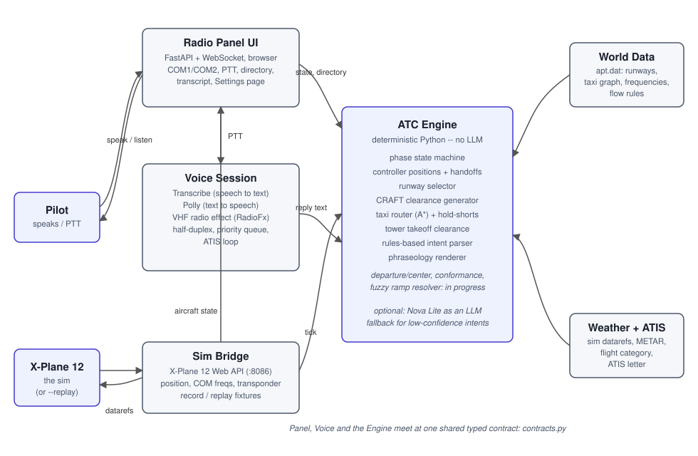

# xatc

**Automated, US FAA-style voice ATC for X-Plane 12.**

You fly, and xatc talks to you like a real controller. You hold push-to-talk and speak
normally; [Amazon Transcribe](features/voice.md) turns that into text, a **deterministic
ATC engine** decides what a controller would say, and [Amazon Polly](features/voice.md)
speaks the reply back through a [VHF radio effect](features/radio-fx.md). A web-based
[radio panel](features/radio-panel.md) tunes COM1/COM2 in sync with the cockpit, shows
the current phase and clearance, and lets you type instead of speak if you'd rather.

The one design choice that shapes everything else: **no AI decides what ATC says.**
Speech recognition and speech synthesis are the only places a model touches this system.
Every clearance, runway, taxi route, and frequency comes from plain, testable Python.
See [Intent parsing & LLM modes](features/intent-parsing.md) for the one narrow,
optional exception -- an LLM can help *understand* an unclear pilot transmission, never
*generate* what ATC says back.

*The radio panel after a clearance and taxi exchange at KSEA: COM2 is transmitting on Seattle Ground, the Status section shows what's been issued (squawk, runway 16L, taxi via B, hold short of 16L), and the transcript shows each pilot call and ATC reply, including the readback checks.*

## What it's like to fly

A typical session at KSEA, gate to hold-short:

1. Tune **118.00** on COM2 and listen to the looping ATIS -- current wind, altimeter,
   ceiling and visibility, active runway, and an information letter that advances when
   the weather changes.
2. Tune **128.00** on COM1 and key up: *"Seattle Clearance, November five four seven
   Golf Alpha, IFR to Portland with information Alpha."* Clearance Delivery reads back a
   full CRAFT clearance -- route, initial altitude, departure frequency, squawk code.
   You read it back.
3. Tune **121.70** and request taxi. Ground gives you a taxiway route to the assigned
   runway, with hold-short instructions wherever it crosses another runway. You read
   that back too.
4. Transmit on a frequency nobody's listening on, and you get silence -- exactly like
   the real thing.

See [Getting Started](getting-started.md) to run it yourself, against a live X-Plane
session or a recorded flight with no sim running at all.

## Status

This project is under active development. The [Features](features/index.md) section
marks every page **Available now** or **Planned** (some **in progress**) based on what's
actually in the code on `main` today, not what's on the drawing board. See the
[Roadmap](roadmap.md) for what's coming next.

## Architecture

The ATC engine is deterministic and has no dependency on AWS or any model -- it runs and
is fully testable in text mode. Voice is a layer on top: audio in, audio out, nothing in
between that can invent a clearance.

That's the system today. For where it's heading (arrival, go-arounds, multi-sector Center and more), see the [eventual architecture](roadmap.md#where-its-heading).

- **[Radio Panel UI](features/radio-panel.md)** -- the pilot's window into the system: a
  FastAPI + WebSocket app serving one dependency-free HTML/JS page.
- **Sim Bridge** -- talks to X-Plane 12's built-in Web API (or replays a recorded
  flight), and is the only place `AircraftState` comes from.
- **[Voice Session](features/voice.md)** -- push-to-talk, Transcribe, Polly, and the
  [VHF radio effect](features/radio-fx.md), all behind a small backend-swappable
  interface.
- **ATC Engine** -- the phase state machine, [controller positions and
  handoffs](features/controller-positions.md), [runway selection](features/runway-selection.md),
  [CRAFT clearances](features/ifr-clearance.md), [taxi routing](features/taxi-routing.md),
  [Tower clearances](features/tower-clearance.md), and the rules-based
  [intent parser](features/intent-parsing.md).
- **World Data** -- parses X-Plane's own `apt.dat` so the ATC matches the scenery you're
  actually flying in: runways, taxiways, frequencies, and wind/visibility flow rules.
- **[Weather + ATIS](features/atis-weather.md)** -- read entirely from the sim, so ATC
  always matches whatever weather you're flying in, real or custom.

Every one of those meets at a single shared, typed contract
(`src/xatc/contracts.py`) -- the data models (`AircraftState`, `Clearance`,
`ControllerPosition`, `AtcTransmission`, ...) and the `AtcEngine` protocol every engine
implementation satisfies.

## Demo script

If you just want to see it work: [Getting Started](getting-started.md#demo-script) has a
five-minute walkthrough, ATIS through taxi clearance, that you can run against a
recorded flight with no X-Plane or AWS account at all.
